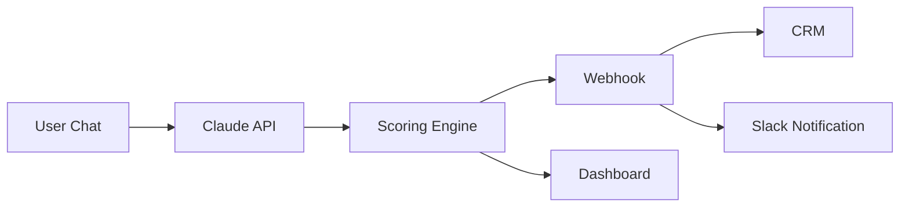

# lead-intelligence-bot

**AI-powered lead qualification chatbot.** Conversational AI that qualifies, scores, and routes leads to your CRM via webhooks.

`Claude API` | `Make.com / n8n integration` | `CRM routing` | `Slack alerts`

[](https://nextjs.org)
[](https://docs.anthropic.com)
[](https://www.typescriptlang.org)
[](./LICENSE)

---

## Demo

> **Screenshot placeholder** — Add a screenshot or GIF of the chat widget and dashboard here.

---

## Features

- **Conversational Lead Qualification** — AI agent asks qualifying questions naturally, not as a form
- **Configurable Scoring Rules** — Define your own scoring weights and thresholds in `config/scoring.json`
- **Webhook Integration** — Forward qualified leads to Make.com, n8n, or Zapier workflows
- **CRM Routing** — Automatically create contacts in HubSpot, Salesforce, or any CRM via webhooks
- **Slack/Teams Notifications** — Instant alerts when a HOT lead comes in
- **Lead Scoring Dashboard** — Real-time dashboard showing all leads, scores, and activity feed
- **Video Avatar Mode** — Optional real-time video avatar with voice (via Anam AI)
- **Streaming Responses** — Claude API streaming for instant, natural-feeling conversation

---

## Architecture



**Flow:**
1. User starts a conversation via text chat or video avatar
2. Claude API handles the conversation using your custom system prompt
3. After sufficient qualifying data is collected, the scoring engine extracts and scores the lead
4. Scored lead is forwarded via webhook to your automation platform
5. CRM contact is created and sales team is notified

---

## Quick Start

### 1. Clone & Install

```bash
git clone https://github.com/your-username/lead-intelligence-bot.git
cd lead-intelligence-bot
npm install
```

### 2. Configure Environment

```bash
cp .env.example .env.local
```

Edit `.env.local` with your API keys:

```env
ANTHROPIC_API_KEY=sk-ant-api03-your-key-here
```

### 3. Customize Questions & Scoring

Edit the configuration files in `config/`:

- [`config/questions.json`](./config/questions.json) — Qualifying questions your bot asks
- [`config/scoring.json`](./config/scoring.json) — Scoring weights and thresholds
- [`config/webhooks.json`](./config/webhooks.json) — Webhook endpoints

### 4. Run Development Server

```bash
npm run dev
```

Open [http://localhost:3000](http://localhost:3000) to see the landing page.
Open [http://localhost:3000/dashboard](http://localhost:3000/dashboard) to see the lead dashboard.

### 5. Deploy

```bash
npx vercel
```

Or deploy to any platform that supports Next.js (Vercel, Railway, Netlify, etc.)

---

## Customization

### System Prompt

Edit `src/lib/system-prompt.ts` to customize the AI agent's personality, knowledge base, and conversation flow. The default prompt follows a 4-phase structure:

1. **Rapport** — Greet and build trust
2. **Qualify** — Ask qualifying questions one at a time
3. **Recommend** — Summarize and recommend next step
4. **Capture** — Collect name and email

### Qualifying Questions

Edit `config/questions.json` to define what your bot asks:

```json
{
  "questions": [
    {
      "id": "challenge",
      "question": "What's your primary business challenge?",
      "weight": 2
    }
  ]
}
```

### Scoring Rules

Edit `config/scoring.json` to tune lead scoring:

```json
{
  "thresholds": { "hot": 8, "warm": 5, "cold": 1 },
  "weights": {
    "budget_match": 3,
    "timeline_urgency": 2,
    "pain_point_clarity": 2
  }
}
```

### Webhook Integration

See [docs/webhooks.md](./docs/webhooks.md) for setup guides for Make.com, n8n, and Zapier.

---

## Tech Stack

| Technology | Purpose |
|-----------|---------|
| [Next.js 16](https://nextjs.org) | Full-stack React framework |
| [Claude API](https://docs.anthropic.com) | Conversational AI (streaming) |
| [Upstash Redis](https://upstash.com) | Serverless lead storage |
| [Anam AI](https://www.anam.ai) | Video avatar (optional) |
| [Make.com](https://www.make.com) / [n8n](https://n8n.io) | Workflow automation |
| [HubSpot](https://www.hubspot.com) | CRM integration |
| [Slack API](https://api.slack.com) | Team notifications |
| [Tailwind CSS](https://tailwindcss.com) | Styling |
| [Vercel](https://vercel.com) | Deployment |

---

## Project Structure

```
src/
├── app/
│   ├── page.tsx              # Landing page with demo
│   ├── dashboard/page.tsx    # Lead scoring dashboard
│   └── api/
│       ├── chat/route.ts     # Claude streaming chat endpoint
│       ├── extract-lead/     # Lead extraction & scoring
│       ├── leads/            # Lead retrieval endpoint
│       └── anam-session/     # Video avatar session
├── components/
│   ├── chat-widget.tsx       # Text chat interface
│   ├── demo-section.tsx      # Demo mode selector
│   └── anam-avatar.tsx       # Video avatar interface
└── lib/
    ├── system-prompt.ts      # AI agent system prompt
    └── leads-store.ts        # Lead storage (Redis/memory)
```

---

## License

MIT License. See [LICENSE](./LICENSE) for details.
